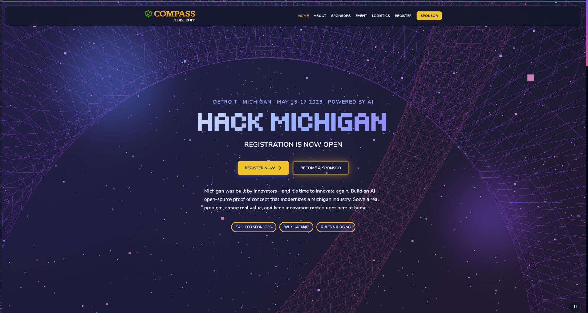

# Hack Michigan (HackMI)

Marketing site and hackathon showcase for **Hack Michigan** — [hackmichigan.com](https://hackmichigan.com). Built with **Astro 5**, **Three.js** background animation, and **Sanity** for teams and project listings.



[](https://github.com/Compass-Detroit/hackmi26/releases)
[](https://astro.build/)
[](https://threejs.org/)
[](LICENSE)

Deploy by connecting this repository to [Vercel](https://vercel.com/docs/frameworks/astro).

Release history: [CHANGELOG.md](CHANGELOG.md).

## Features

- **Landing experience** — Hero, about, sponsors, event details, logistics, signup, and campaign CTA sections
- **Hackathon area** — `/hackathon/` project grid, per-project pages, and team pages with optional member social links
- **Sanity CMS** — Teams and hackathon projects; embedded Studio at `/studio` (via `@sanity/astro`)
- **Three.js background** — Particle field and wireframe accents (respects reduced motion; pause control)
- **Design system** — Scoped component styles plus tokens in `src/styles/global.css` (self-hosted **Tiny5** + **Nunito**)
- **Configurable imagery** — Header brand, org logos, footer sponsors (`src/data/siteLogos.ts`)
- **Analytics** — [Vercel Analytics](https://vercel.com/docs/analytics) (`@vercel/analytics`)
- **TypeScript**, sitemap, client-side transitions (`ClientRouter`)

## Requirements

- **Node.js** >= 22.22.2 (see `package.json` `engines`)

## Quick start (site)

```bash
git clone https://github.com/Compass-Detroit/hackmi26.git
cd hackmi26

npm install
npm run dev
```

Open [http://localhost:4321](http://localhost:4321).

```bash
# Production build
npm run build

# Preview build
npm run preview
```

## Environment

**Astro site** (`astro.config.mjs`) reads public Sanity vars via Vite `loadEnv` from the **repo root** `.env` files. Defaults match the shared HackMI project if unset:

```env
PUBLIC_SANITY_PROJECT_ID=your_project_id
PUBLIC_SANITY_DATASET=production
```

**Standalone Studio** (`studio-hack-michigan-/`) resolves project and dataset in `sanity.env.ts`:

1. `SANITY_STUDIO_PROJECT_ID` / `SANITY_STUDIO_DATASET` — use these to point local Studio or CLI at a **non-production** dataset without changing site build vars.
2. Otherwise falls back to the same `PUBLIC_SANITY_*` names (handy if you duplicate vars in `studio-hack-michigan-/.env`).
3. Otherwise the same built-in defaults as the Astro config.

The Sanity CLI loads `.env` from `studio-hack-michigan-/` when you run `sanity dev` or `sanity deploy`.

For Facebook Open Graph sharing you can set `PUBLIC_FB_APP_ID` (see `src/env.d.ts`).

## Sanity Studio (standalone)

The Studio app lives in `studio-hack-michigan-/`. Use it for a dedicated CMS dev server or deploys:

```bash
cd studio-hack-michigan-
npm install
npm run dev
```

Schemas: `studio-hack-michigan-/schemaTypes/` (`team`, `hackathonProject`). Team members support optional profile URLs (GitHub, LinkedIn, X, Bluesky, Mastodon, Instagram, personal site).

## Content model (high level)

| Source                                  | What it drives                                         |
| --------------------------------------- | ------------------------------------------------------ |
| `src/data/*.ts`, `src/lib/constants.ts` | Event copy, nav, agenda hints, external links          |
| `src/data/siteLogos.ts`                 | Logos in header, footer, sections                      |
| Sanity `team` / `hackathonProject`      | `/hackathon/` listings, team and project detail routes |

Fetched in `src/lib/sanity.ts` at build time for static pages.

## Code style

- **Prettier** (including double quotes for JS/TS)
- **ESLint** (Astro + TypeScript)
- **Stylelint** for CSS in Astro/components

```bash
npm run format          # write
npm run format:check    # CI
npm run lint
npm run lint:css
npm run typecheck       # astro check
npm run verify          # format + lint + lint:css + typecheck + build
```

## Customization

- **Colors, type, motion tokens** — `src/styles/global.css` (`:root` variables)
- **Event name, dates, URLs** — `src/data/event.ts`, `src/lib/constants.ts`
- **Astro** — `astro.config.mjs` (site URL, Sanity, MDX, sitemap)

## Project structure

```
src/
├── components/     # UI sections and primitives
├── data/           # Event, nav, logos, agenda (TypeScript)
├── layouts/        # BaseLayout (meta, fonts, transitions)
├── lib/            # sanity client helpers, constants
├── pages/          # Routes (index, hackathon/*)
├── styles/         # global.css
└── env.d.ts        # Import meta env typings

studio-hack-michigan-/
├── schemaTypes/    # Sanity document schemas
├── sanity.config.ts
└── sanity.cli.ts
```

## For developers

### Repository layout

- **Root** — Astro site (`package.json`, `src/`, `astro.config.mjs`). This is what Vercel builds.
- **`studio-hack-michigan-/`** — Sanity Studio (separate `package.json`). Run it when you are editing schemas or content outside the embedded `/studio` shell.

### Architecture notes

- **Rendering** — Static output (`output: "static"`). Hackathon routes use `getStaticPaths()` and load Sanity in `src/lib/sanity.ts` at **build time**; a full `npm run build` needs the Sanity API reachable with the configured project/dataset.
- **Client navigation** — `ClientRouter` in `BaseLayout` enables SPA-style transitions. Client scripts that must re-run after navigation should listen for `astro:page-load` (see `ThreeBackground.astro` and the layout cursor script).
- **Styles** — Component-scoped `<style>` blocks plus shared tokens in `src/styles/global.css`. No Tailwind in this repo.
- **Paths** — TypeScript path alias `~/*` → `src/*` (see `tsconfig.json`).
- **Config** — Site URL, `trailingSlash`, Sanity integration, and env loading live in `astro.config.mjs`. Vite’s `loadEnv` is used for `PUBLIC_*` variables when the config is evaluated.

### Day-to-day workflow

1. `npm install` at the repo root; `npm run dev` for the marketing site.
2. When changing Sanity schemas or bulk-editing content, run `npm run dev` inside `studio-hack-michigan-/` as well (or use the site’s `/studio` route after `astro dev`).
3. After schema changes, update GROQ usage and any page types in `src/` as needed, then confirm `/hackathon/` and detail pages still build.
4. Regenerate Astro ambient types if needed: `npx astro sync`.

### Quality gate

```bash
npm run verify
```

This runs format checks, ESLint, Stylelint, `astro check`, and a production build. If the build step fails on Sanity fetches, confirm env vars and network access to the dataset.

## Tech stack

- [Astro 5](https://astro.build/) — SSG, MDX, View Transitions / `ClientRouter`
- [Three.js](https://threejs.org/) — Background canvas
- [Sanity](https://www.sanity.io/) — Content API + Studio
- [TypeScript](https://www.typescriptlang.org/)
- [@astrojs/mdx](https://docs.astro.build/en/guides/integrations-guide/mdx/), [@astrojs/sitemap](https://docs.astro.build/en/guides/integrations-guide/sitemap/)

## Credits

Thanks to the developers who lead this project:

- **[shrinkray](https://shrinkraylabs.com/)** - Shrinkray Interactive, a full-service creative software design, development, and maintenance company
- **[shumunovsolutions](https://www.shumunovsolutions.com/)** - Shumunov Solutions, a software development and consulting company

Partner studios who supported delivery are credited on the live site in the **Website Development** footer section (`src/components/BuiltByRow.astro`).

## License

MIT — see [LICENSE](LICENSE).
